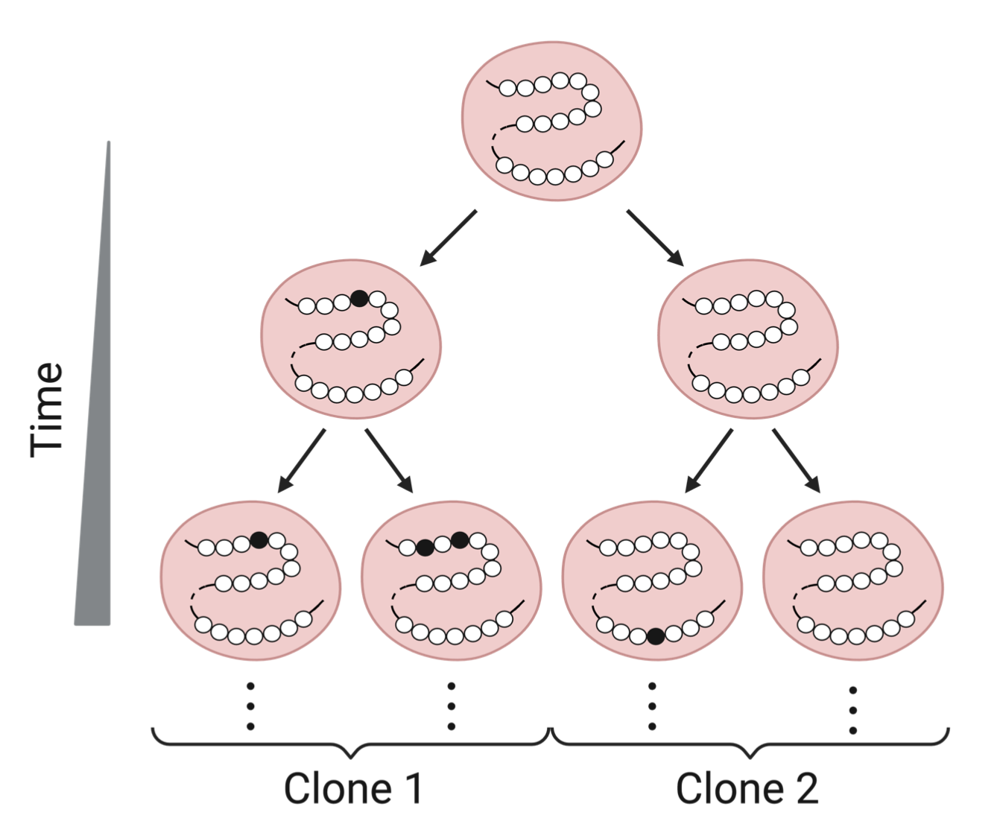
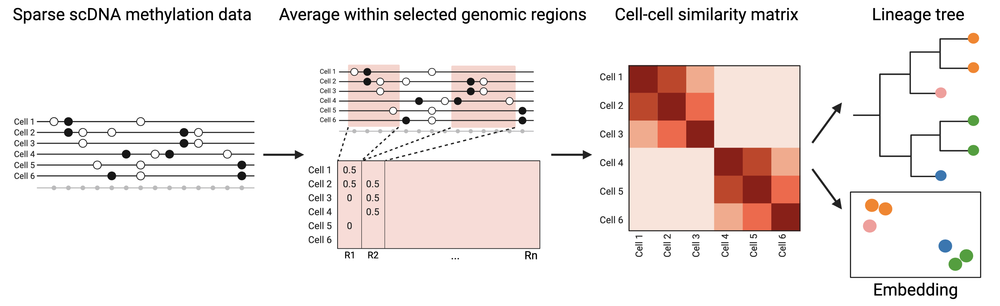
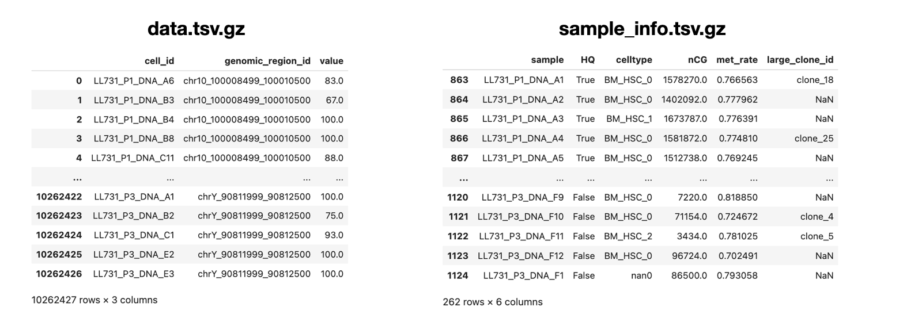

# MethylTree: High-resolution, noninvasive single-cell lineage tracing based on DNA methylation epimutations

<p align="center">
  
</p>

MethylTree utilizes frequent yet stable epimutations on sparse single-cell DNA methylation profiles to build a lineage tree that reflects cell division histories. This approach is highly accurate and does not require genetic manipulation for the cells of interest, thus applicable to human tissues. This is based on our recent manuscript (Chen & Fu et.al., Nature Methods, 2024).




## Installation
Please setup a conda environment called `MethylTree`. This is our core environment
```bash
conda create -n MethylTree python=3.9 --yes
conda activate MethylTree
pip install poetry
cd MethylTree # Go to the MethylTree directory
poetry install
cd ..
pip install methscan
pip install jupyterlab
python -m ipykernel install --user --name=MethylTree
```

## MethylTree analysis
The usage of MethylTree is illustrated in the test module `test/MethylTree`. The `MethylTree.ipynb` notebook can be executed directly on the test dataset. The test data is a subset of the DARLIN dataset (Li et.al., Cell, 2023). This notebook offers a detailed tutorial of the key functionalities of MethylTree, including lineage tree reconstruction, visualization, result characterization, embedding, clone inference etc. Please use the `MethylTree` environment.





### Input Overview

The input consists of the following files:

-  `data.tsv.gz`: this data file contains the methylation rate for each selected genomic region of each cell, with three columns in total (`cell_id`, `genomic_region_id`, `value`). This is the long-format pandas table of the cell-by-region methylation matrix.
- `sample_info.tsv.gz`: this metadata file describes various parameters for each cell sample, with at least three columns(`sample`, `HQ`, `Clone_key`). The field `sample` is identical to the field of `cell_id` in `data.tsv.gz`.

#### `data.tsv.gz`

| **Column**          | **Required** | **Type** | **Description**                                              |
| ------------------- | ------------- | -------- | ------------------------------------------------------------ |
| `cell_id`           | ✔️             | `str`    | the name of each cell                                 |
| `genomic_region_id` | ✔️             | `str`    | the name of a selected genomic region on the cell            |
| `value`             | ✔️             | `float`  | methylation rate in the specified genomic region of the cell. Values are percentages without % |

Website will not automatically merge regions (`ED Fig.1 c`). If need to merge regions, please do so before generating this file.

#### `sample_info.tsv.gz`

| **Column**     | **Required** | **Type** | **Description**                                              |
| -------------- | ------------- | -------- | ------------------------------------------------------------ |
| `sample`       | ✔️             | `str`    | the name of each cell, identical to `cell_id` in `data.tsv.gz`. |
| `HQ`           | ✔️             | `bool`   | the scBS-seq quality control status for each cell. Cells that pass quality control are marked as True. Only these cells will be used for lineage reconstruction. |
| `Clone_key`    | ✔️             | `str`    | the true lineage information for each cell. This information is not needed for running MethylTree. However, we use it as a placeholder for visualization. Lineage reconstruction accuracy will be computed based on this information. If the actuall lineage information is not available, you can replace it with other cell information that you are interested for visualization.|
| `Celltype_key` |               | `str`    | the cell type information for each cell. DNA methylation is known to also modulate cell types. If the user's data include multiple cell types, they may wish to remove this confounding factor to more accurately infer lineage histories. If so, this column is necessary. |

Users can add more columns as needed. These additional columns can be displayed in the color bar of the final heatmap.


## Output Overview

The output is a `.zip` file. It contains all the dataset information, including `the input details`, `the heatmap of cell-cell similarity matrix`, `the reconstructed lineage tree`, and `the accuracy of the reconstructed lineage tree`.  The final accuracy is measured based on the `Column for clone ID` in the `Basic` selection of the `Configure` section. The heatmap will also use this column by default to display the color bar.

- `result.h5ad`: This is the core result file, which can be read as an `adata` file, including all the dataset information.
- `lineage_tree.txt`: A lineage tree reconstructed using the `UPGMA` algorithm based on the similarity matrix calculated by `MethylTree`.
- `lineage_order.npy`: The sequential clone information of the leaf nodes in the reconstructed lineage tree.
- `state_clone_info.csv`: The index and clone_ID of each cell.
- `accuracy_at_varying_threshold.csv`: Describes how changes in similarity thresholds affect clone identification accuracy.
- `accuracy.csv`: By analyzing the leaf nodes of the reconstructed lineage tree, a sorted sequence of cells is obtained (`lineage_order`). Various metrics (`accuracy`, `continuity`, `entropy`, and `Wasserstein distance`) are used to evaluate the performance of `each clone` in this sequence. Additionally, the ordered sequence of cells are randomly shuffling and the corresponding accuracy is also computed on this randomized data.
- `stats.txt`: It calculates the weighted average and arithmetic average of `accuracy`, `continuity`, `entropy`, and `wasserstein distance` for all clones. 
- `accuracy_by_depth.pdf`: Visualizing how the accuracy of reconstructing the original clones and the number of identified clones change with the depth of the reconstructed phylogenetic tree.
- `memory_pvalue.pdf`: Shows the distribution of similarity scores within each clone or for randomized clones and calculates the overall `p-value` to evaluate the significance of within-clone methylation similarity.
- `pvalue_for_individual_clone.pdf`: Displays the `p-value` for each clone to evaluate wether the within-clone methylation similarity is statistically significant compared to the randomized background.
- `similarity_matrix_multiple_colorbars.pdf`: Visualization of the calculated cell-to-cell methylation similarity matrix.

#### `result.h5ad`

| **section**                        | **Description**                                              |
| ---------------------------------- | ------------------------------------------------------------ |
| `adata.X`                          | a cell by region matrix, corresponding to the content of the `data.tsv.gz`. |
| `adata.obs`                        | contains the information from the `sample_info.tsv.gz`.      |
| `adata.uns['accuracy']`            | a summary of the metrics evaluating the `MethylTree` reconstructed lineage. This content is found in the `stats.txt` file. |
| `adata.uns['order_x']`             | the numeric order of the leaf nodes in the reconstructed lineage tree. |
| `adata.uns['ordered_clone_array']` | the `Clone_key` of the ordered leaf nodes in the reconstructed lineage tree. This content is found in the `lineage_order.npy` file. |
| `adata.obsm['X_similarity']`       | the Pearson correlation coefficient between different cells, corresponding to the `similarity_matrix_multiple_colorbars.pdf` . |

#### `state_clone_info.csv`

| **Column**   | **Description**                          |
| ------------ | ---------------------------------------- |
| `index`      | the sample name of each cell.            |
| `state_info` | the index to uniquely identify each cell |
| `clone_id`   | the clone to which each cell belongs.    |

#### `accuracy_at_varying_threshold.csv`

| **Input**          | **Description**                                              |
| ------------------ | ------------------------------------------------------------ |
| `weight_threshold` | The similarity threshold used for identifying clones. Different thresholds determine how similar cells must be to be considered part of the same clone. |
| `accuracy`         | The accuracy of clone identification at a given similarity threshold. This metric evaluates the effectiveness of clone identification based on the selected threshold. |
| `cell_fraction`    | The proportion of cells identified as clones at a given similarity threshold. This represents the fraction of cells in the dataset that are recognized as clones. |

#### `accuracy_by_depth.pdf`

| **Axis**                  | **Description**                                              |
| ------------------------- | ------------------------------------------------------------ |
| `Lineage tree depth`      | Depth of the reconstructed phylogenetic tree. Depth 0 is the root node, increasing depth moves towards the leaf nodes. |
| `Reconstruction accuracy` | Accuracy of reconstructing the original clones at different depths. Represented by a red solid line with circles (o-). |
| `Clone number (size > 1)` | Number of unique clones identified at each depth. Represented by a blue dashed line (--). |

#### `memory_pvalue.pdf`

| **Axis**                   | **Description**                              |
| -------------------------- | -------------------------------------------- |
| `Average similarity score` | the frequency of different similarity        |
| `Normalized frequency`     | the probability of each similarity occurring |

| **Colors**                   | **Description**                                       |
| ---------------------------- | ----------------------------------------------------- |
| `Light blue (Inter-clone)`   | the distribution of similarity scores between clones. |
| `Light orange (Intra-clone)` | the distribution of similarity scores within clones.  |

